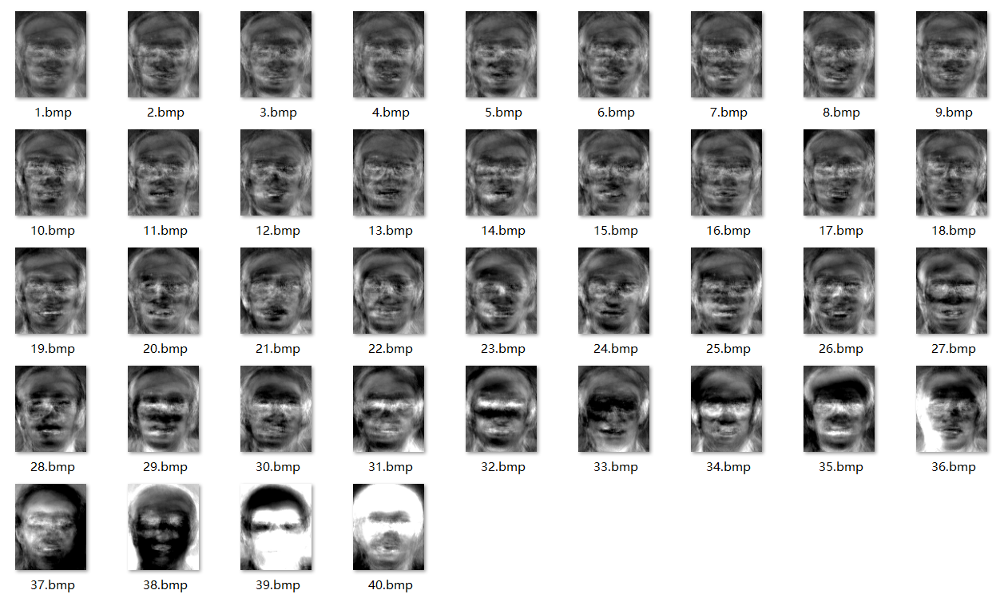

#<center>数字图像处理期末项目———基于PCA的人脸识别</center>
###<center>姓名：高俊杰</center>
###<center>学号：15331087</center>

##一、算法描述

这次项目人脸识别只要靠PCA算法实现，算法的主要步骤如下：

1.首先，应题目要求，对于所有的Faces集里的40个人，各随机取出其10张图像中的7张用作训练集，剩余3张用作后续的测试。这里我的做法是先将每个人的随机抽出的7张图像作一次平均从而得到一张平均后的图像。然后把40个人对应的平均图像都分别缓存起来，成为train_imgs。

2.然后，将40张train_imgs都拉伸成列向量并将所有列拼在一起，由于每张图像的总像素数都为10304，这样就得到了10304*40的矩阵X。

3.X的每列再减去均值向量，从而中心化。

4.求出X的转置和X的矩阵乘积，并求出乘积40*40矩阵的特征向量，这里用的是matlab的eig函数。

5.滤出前K大的特征值对应的特征向量W，再将X乘上W映射得到V，将V的每一列向量作为后续映射关系的一组基向量，共有K个基向量，也可以称为K个特征脸。

6.将X每一列都通过基向量矩阵V映射到对应的特征空间中。这样相当于将每张图像train_imgs都在新的空间中找到了对应的位置。

7.对于每个测试图像，也进行类似上述的变换：转成列向量，减去均值向量而中心化，然后用基向量矩阵映射到特征空间中。

8.要判断测试图像和40张train_imgs的哪张最匹配，只需对比测试图像在特征空间的新坐标和40张train_imgs在特征空间的坐标直接的欧几里得距离（或二范数）的大小，找到二范数最小的对应的train_img，就找到了最匹配训练图像了。

9.综上所述，这种算法的主要思想就是，去除部分无关的或者关系较小的向量，保留影响较大的向量作基，这样即减少了基向量的数目从而减少了运算量，同时又减少了图像细节，能避免无关的向量和测试图像主人公的表情、脸朝向和配饰等变化对测试准确性产生不良干扰。

##二.Matlab代码

函数Get_Training_Set.m(用来随机读取40*7张图像并分别作平均产生训练集)：
```matlab
function [ mean_img ] = Get_Training_Set( input_path, index, height, width, output_path )
    imgs = zeros(length(index), height, width);
    for i = 1 : length(index)
        imgs(i, :, :) = imread([input_path '/' num2str(index(i)) '.pgm']);
    end
    mean_img = zeros(height, width);
    for i = 1 : height
       for j = 1 : width
           mean_img(i, j) = sum(imgs(:, i, j)) / length(index);
       end
    end
    mean_img = uint8(mean_img);
%     imwrite(mean_img, [output_path '.bmp'], 'bmp');
end
```

函数Test_Case.m（用来测试单张图像，循环调用即可测试所有的测试集图像）：
```matlab
function [ found ] = Test_Case( V, eigenfaces, indexes, i, j, mean_img )
    f = imread(['Faces/S' num2str(i) '/' num2str(indexes(i, j)) '.pgm']);
    [height, width] = size(f);
    f = double(reshape(f, [height * width, 1])) - mean_img;
    f = V' * f;
    [~, N] = size(eigenfaces);
    distance = Inf;
    found = 0;
    for k = 1 : N
        d = norm(double(f) - eigenfaces(:, k), 2);
        if distance > d
            found = k;
            distance = d;
        end
    end
end
```

脚本Eigenface.m（直接运行即可，调用了上述函数，结果数据中accuracy即为单次运行的准确百分比）：
```matlab
N = 40;
K = 10;
height = 112;
width = 92;

indexes = zeros(N, 10);
train_imgs = zeros(N, height, width);
for i = 1 : N
    indexes(i, :) = randperm(10);
    train_imgs(i, :, :) = Get_Training_Set(['Faces/S' num2str(i)], indexes(i, 1 : 7), 
    height, width, ['TrainSet/' num2str(i)]);
end
train_imgs = uint8(train_imgs);

X = zeros(height * width, N);
for i = 1 : N
    X(:, i) = reshape(train_imgs(i, :, :), [height * width, 1]);
end
mean_img = mean(X, 2);
for i = 1: N
   X(:, i) = X(:, i) - mean_img; 
end
L = X' * X;
[W, D] = eig(L);
% e = mapminmax(X * W, 0, 255);
% for i = 1 : N
%    imwrite(uint8(reshape(e(:, i), [height, width])), ['eigen/' num2str(i) '.bmp'], 'bmp'); 
% end
W = W(:, N - K + 1 : N);
V = X * W;
eigenfaces = V' * X;

accuracy = 0;
for i = 1 : N
    for j = 8 : 10
%         subplot(6, 40, i + (j - 8) * 80);
%         imshow(f);
%         title(['S' num2str(i)]);
        found = Test_Case(V, eigenfaces, indexes, i, j, mean_img);
        if found == i
            accuracy = accuracy + 1;
        end
%         subplot(6, 40, i + 40 + (j - 8) * 80);
%         imshow(['TrainSet/' num2str(found) '.bmp']);
%         title(['S' num2str(found)]);
    end
end
accuracy = double(accuracy / (3 * N));
```


##三、测试性能表格


循环执行上述脚本，对于每个K值（取值在1~40，因为对每7张图像已预先做了一次平均，总图像数目降为40，不再是280，故不能照取50~100）测试分别测试了5次，每次120张测试图像（运行时间较长，故不测试太多次），得到的准确率如下：


可以看到，随着K增大，准确率先是减速地上升，然后K达到约7以后，准确率的均值就基本在70%到80%间徘徊，部分时候会超过80%。在这里测试的噪声估计不强，所以K较大时准确率还是基本不受影响。

##四、过程及结果图像

如图，最先通过对每人7张图像求均值得到的训练集图像如下：


如图，由上述40张平均图像通过上述算法转换而来的特征图像如下(已按特征值从小到大排序)：



下图是选取部分K的取值时的结果，奇数行为测试图像，偶数行为上一行输入所匹配的人脸均值图像。若测试行的标题和匹配行的标题一致，则说明匹配到了正确的人脸。

选取K为8时得到的结果图像1：


测试准确率：


选取K为10时得到的结果图像2：


测试准确率：


选取K为12时得到的结果图像3：


测试准确率：


选取K为14时得到的结果图像4：


测试准确率：


选取K为16时得到的结果图像5：


测试准确率：


由于测试有一定的随机性，且测出来的准确率也较符合预期，故认为人脸识别的准确率在以上K的取值情况下变化不大，均在75%左右。同时，在随机选择训练集和测试集的情况下，经过数十次的测试，每次测试的120张图像的匹配结果大多能克服细节上的干扰（如仪态、角度、配饰等无关元素），故认为本次人脸识别项目的目标已基本达成。